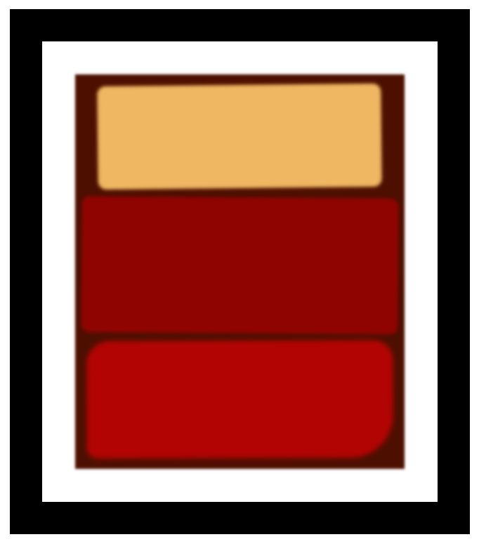

# Rothko Painting

### :hammer_and_wrench: Rothko Painting Project

Using CSS and the Box Model to create Rothko-style rectangular art pieces.

- HTML
- CSS
    {padding:;
    transform: rotate;
    box-shadow:;
    border-radius:;
    filter: blur();
    }

------
**This is how it looks!**

